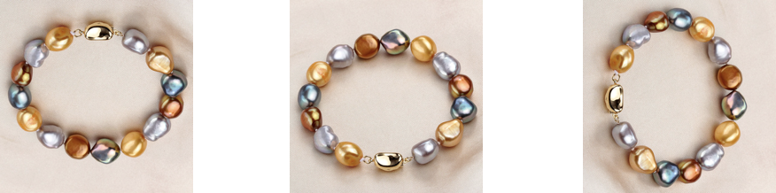

# $G$-action on a set $X$

Orbit set $X/G$ is the set of orbits of the $G$-action on $X$.

If $|X/G|=1$, then the $G$-action on $X$ is **transitive**.

For transitive action, 

$X \cong G / Stab_G(x)$ as $G$-set.

---

# Free Action

A $G$-action on a set $X$ is called **free** if for all $x \in X$, $Stab_G(x) = \{e\}$.

In other words, only the identity element of $G$ fixes any element of $X$.

**Equivalently**: $g \cdot x = x$ implies $g = e$ for all $x \in X$ and $g \in G$.

In this case,
$$
|X/G|  = |X| / |G|
$$

---
If $G$ action on $X$ is both **free** and **transitive**, then $X$ is called a $G$-torsor.

**Example**: The Euclidean space is a $\mathbb{R}^3$-torsor. 

---

*Question*: How to compute $|X/G|$ for in a general case?

---

# Burnside's Lemma

**Theorem (Burnside's Lemma)**: Let $G$ be a finite group acting on a finite set $X$. Then the number of orbits is:

$$
|X/G| = \frac{1}{|G|} \sum_{g \in G} |X^g|
$$

where $X^g = \{x \in X : g \cdot x = x\}$ is the set of elements fixed by $g$.

**In words**: The number of orbits equals the average number of fixed points.

---

# Proof of Burnside's Lemma

Consider the set $S = \{(g, x) \in G \times X : g \cdot x = x\}$.

Now there are double fiberation:
$$
G \leftarrow S \rightarrow X
$$

---

# Proof (continued)

We can count $|S|$ in two ways:

1. **By group elements**: $|S| = \sum_{g \in G} |X^g|$

2. **By set elements**: $|S| = \sum_{x \in X} |Stab_G(x)|$

By the orbit-stabilizer theorem: 

 $$|Stab_G(x)| = \frac{|G|}{|G \cdot x|}$$

---

# Proof (continued)

$$
\sum_{g \in G} |X^g| = \sum_{x \in X} |Stab_G(x)| = \sum_{x \in X} \frac{|G|}{|G \cdot x|}
$$

Group elements by their orbits:

$$
= \sum_{\mathcal{O} \in X/G} \sum_{x \in O} \frac{|G|}{|O|}
= \sum_{O \in X/G} |O| \cdot \frac{|G|}{|O|}
= \sum_{O \in X/G} |G|
= |X/G| \cdot |G|
$$

Therefore:
$$
|X/G| = \frac{1}{|G|} \sum_{g \in G} |X^g|
$$

---

# Alternative Form: Sum over Conjugacy Classes

Since $|X^g|$ only depends on the conjugacy class of $g$, we can rewrite Burnside's Lemma as:

$$
|X/G| =  \sum_{[g] \in \text{Conj}(G)} \frac{1}{|Z(g)|} \cdot |X^g|
$$

where $[g]$ denotes the conjugacy class of $g$. 

---

# Application: 

How many distinguishable ways can seven people be seated at a round table, where there is no distinguishable “head” to the table? 

---
# Application: Counting Necklaces

How many distinguishable necklaces can be made using 7 beads with two different colors (red / blue)?  

---

# Solution: Counting Necklaces with Burnside's Lemma

**Step 1: Identify the group action**
The dihedral group $D_7$ acts on the set of necklaces.

Conjugacy class of $D_7$ = $[e], [r], [r^2],[r^3], [s]$. 

---

# Solution (continued)

**Step 2: Count fixed points for each rotation**

- $X^e$ (identity): All 128 colorings are fixed
  - $|X^e| = 2^7 = 128$

- $X^{r^k}$: $k = 1,2,\cdots, 6$. 
A coloring is fixed iff all beads have the same color 
  
  $|X^{r^k}| = 2$ (all red or all blue)

---

# Solution (continued)

**Step 3: Apply Burnside's Lemma**

$$
|X/G| = \frac{1}{|G|} \sum_{g \in G} |X^g|
$$

$$
= \frac{1}{14}(|X^e| + 6 * |X^r| + 7 * |X^s| )
$$

$$
= \frac{1}{14}(128 + 6 * 2 + 7 * 16 )
= 18
$$

**Answer**: There are **18** distinguishable necklaces.

