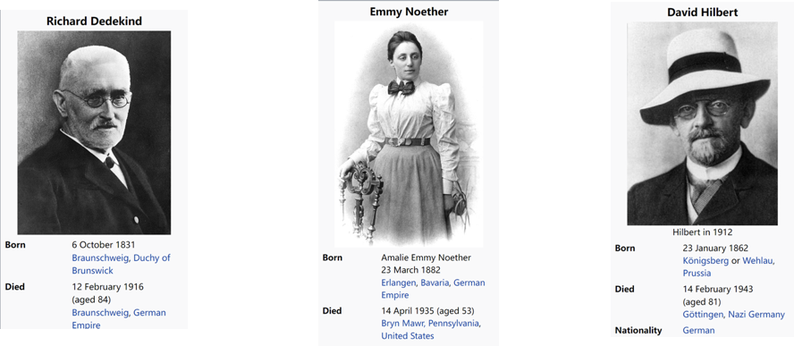
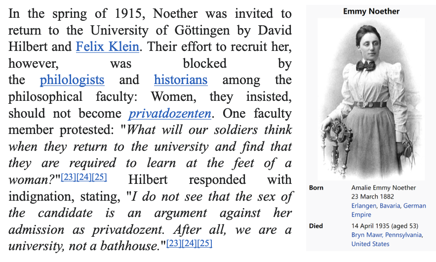
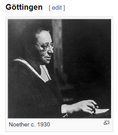
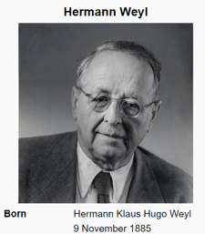
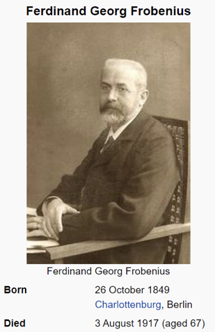

# Ring Theory 
## MAT211

---

---

---
Emmy Noether's scientific production fell into three clearly distinct epochs:
- the period of relative dependence, 1907–1919
- the investigations grouped around the general theory of ideals 1920–1926
- the study of the non-commutative algebras, their representations by linear transformations, and their application to the study of commutative number fields and their arithmetics.
— Weyl 1935

 

---
In his 27th year, Van der Waerden published his Moderne Algebra, an influential two-volume treatise on abstract algebra, still cited, and perhaps the first treatise to treat the subject as a comprehensive whole.

---

## Ring Definition

A **ring** $(R, +, \cdot)$ is a set $R$ together with two binary operations $+$ and $\cdot$, which we call *addition* and *multiplication*, defined on $R$ such that the following axioms are satisfied:

## Ring Axioms

**$\mathcal{R}_1$.** $(R, +)$ is an abelian group.

**$\mathcal{R}_2$.** Multiplication is associative.

**$\mathcal{R}_3$.** For all $a, b, c \in R$, the **left distributive law**, $a \cdot (b + c) = (a \cdot b) + (a \cdot c)$ and the **right distributive law** $(a + b) \cdot c = (a \cdot c) + (b \cdot c)$ hold.

---

## Commutative Ring

A ring $(R, +, \cdot)$ is called **commutative** if the multiplication operation is commutative, i.e., $a \cdot b = b \cdot a$ for all $a, b \in R$.

---

## Examples of Commutative Rings

The following are examples of commutative rings:

- The ring of integers: $(\mathbb{Z}, +, \cdot)$
- The field of rational numbers: $(\mathbb{Q}, +, \cdot)$
- The field of real numbers: $(\mathbb{R}, +, \cdot)$
- The field of complex numbers: $(\mathbb{C}, +, \cdot)$
- The ring of integers modulo $n$: $(\mathbb{Z}_n, +, \cdot)$

---

## Example (Non-Commutative)

The following are examples of non-commutative rings (n>=2):

- The ring of $n \times n$ matrices over the integers: $M_n(\mathbb{Z})$
- The ring of $n \times n$ matrices over the rational numbers: $M_n(\mathbb{Q})$
- The ring of $n \times n$ matrices over the real numbers: $M_n(\mathbb{R})$

---

# Let $(R, +, \cdot)$ be a ring

## Notation

**0** : the identity of the abelian group $(R, +)$

**$-a$** : the inverse of $a$ in the abelian group $(R, +)$

Note: $0 + 0 = 0$ and $a + (-a) = 0$

---

**Lemma:** $0 \cdot a = a \cdot 0 = 0$

<strong>Proof</strong>

$0 \cdot a = (0 + 0) \cdot a = 0 \cdot a + 0 \cdot a$

$\Rightarrow 0 = 0 \cdot a$

Similarly, $a \cdot 0 = a \cdot (0 + 0) = a \cdot 0 + a \cdot 0$

$\Rightarrow a \cdot 0 = 0$

Also note: $a \cdot 0 = 0 \Rightarrow a \cdot (-0) = a \cdot 0 = 0$

---

## Lemma 1: $a(-b) = -ab = (-a)b$

<strong>Proof</strong>

$a(-b) = -ab \Leftrightarrow ab + (a(-b)) = 0 \Leftrightarrow a(b + (-b)) = 0$

$\Leftrightarrow a \cdot 0 = 0$ 

(Note: $a \cdot 0 = 0$ holds by previous lemma)

---

## Lemma 2: $(-a)(-b) = ab$

<strong>Proof</strong>

$(-a)(-b) = -(a(-b))$

$= -(-ab) = ab$

(using Lemma 1)

---

# Scalar Multiplication in Rings

## Let $(R, +, \cdot)$ be a ring

For $n \in \mathbb{Z}, a \in R$

$$na = \begin{cases}
\underbrace{a + a + \cdots + a}_{n\text{-times}} & \text{if } n > 0 \\
0 & \text{if } n = 0 \\
-(\underbrace{a + a + \cdots + a}_{-n\text{-times}}) & \text{if } n < 0
\end{cases}$$

**Note:** $(-n)a = n(-a)$ and $a^i = \underbrace{a \cdot a \cdot a \cdots a}_{i\text{-times}}$ for $i \geqslant 0$

---

## Lemma

**Lemma:** For $n, m \in \mathbb{Z}, a, b \in R$, we have

$$(na)(mb) = (nm)ab$$

<strong>Proof</strong>

 By previous lemmas, suffice to prove when $n, m$ are positive.

$(na)(mb) = (\underbrace{a + a + \cdots + a}_{n})({\underbrace{b + b + \cdots + b}_{m}}) = \underbrace{ab + ab + \cdots + ab}_{nm\text{-times}}$

---

# Ring with Unity

## Definition

A ring with a multiplicative **identity element** is a **ring with unity**.

The multiplicative identity element $1_R$ is called **"unity"**.

$\forall a \in R \quad 1_R a = a 1_R = a$

**Note:** $(R, \cdot)$ is a monoid.

---

## Property

For $n, m \in \mathbb{Z}$, $1_R$ is the unity in $R$:

$$(n 1_R)(m 1_R) = (nm) 1_R$$

<strong>Proof</strong>

$(n 1_R)(m 1_R) = (nm)(1_R 1_R)$

$= (nm) 1_R$

---

# Ring Homomorphism
## Definition

For rings $R$ and $R'$, a map $\phi : R \to R'$ is a **homomorphism** if the following two conditions are satisfied for all $a, b \in R$:

1. $\phi(a + b) = \phi(a) + \phi(b)$
2. $\phi(ab) = \phi(a)\phi(b)$

---

# Example of Ring Homomorphism
Let $m, n \in \mathbb{Z}^+$ such that $m \mid n$.
 $$\varphi: \mathbb{Z}_n \to \mathbb{Z}_m$$ 
 by $\varphi([a]_n) = [a]_m$ for any $[a]_n \in \mathbb{Z}_n$, where $[a]_n$ denotes the equivalence class of $a$ modulo $n$, and similarly for $[a]_m$.

---

## Kernel

**kernel** $\text{Ker}(\phi) = \{a \in R \mid \phi(a) = 0'\}$

**Note:** $(R, +)$ and $(R', +)$ are groups. Condition 1 implies $\phi(0_R) = 0_{R'}$. Also, $\text{Ker}(\phi) = \{0\} \Leftrightarrow \phi$ is injection.

---

# Subring 
## Definition

A **subring** $S$ of a ring $R$ is a subset of $R$ that is itself a ring under the same addition and multiplication operations defined on $R$.

---

### Example

- The set of even integers $2\mathbb{Z}$ is a subring of $\mathbb{Z}$.
- $\mathbb{Z}$ is a subring of $\mathbb{Q}$, which in turn is a subring of $\mathbb{R}$.
- For any ring $R$, both $\{0\}$ and $R$ itself are subrings of $R$. These are called the **trivial subrings**.

---

# Ideal of a Ring
## Definition

A **ideal** $I$ of a ring $R$ is a subset of $R$ such that:
1. $(I, +)$ is a subgroup of $(R, +)$.
2. For all $r \in R$ and $a \in I$, we have $ra \in I$ and $ar \in I$.

--- 

# Quotient Ring
## Definition

Given a ring $R$ and an ideal $I$ of $R$, the **quotient ring** $R/I$ is the set of cosets $\{r + I \mid r \in R\}$, where:

- **Addition** is defined as:  
  $(r_1 + I) + (r_2 + I) = (r_1 + r_2) + I$

- **Multiplication** is defined as:  
  $(r_1 + I)(r_2 + I) = r_1 r_2 + I$

These operations are well-defined, making $R/I$ a ring.

---

# Canonical Projection
## Definition

The **canonical projection** $\pi: R \to R/I$ is defined as:
$$\pi(r) = r + I$$
for all $r \in R$.

---

# Universal property of the quotient ring

Let $R$ be a ring and $I$ an ideal of $R$. 

For any ring $S$ and any ring homomorphism $\phi: R \to S$ such that $I \subseteq \ker(\phi)$, there exists a unique ring homomorphism $\bar{\phi}: R/I \to S$ such that the diagram commutes:

$$
\begin{array}{ccc}
R & \xrightarrow{\pi} & R/I \\
\phi \downarrow & \swarrow{\bar{\phi}} & \\
S &  &
\end{array}
$$

---

## Examples

- In any ring $R$, the set $\{0\}$ and $R$ itself are ideals.
- In the ring of integers $\mathbb{Z}$, the set $n\mathbb{Z} = \{nk \mid k \in \mathbb{Z}\}$ is an ideal for any integer $n$.
- In a commutative ring $R$, for any element $a \in R$, the set $(a) = \{ra \mid r \in R\}$ is an ideal, called the principal ideal generated by $a$.

---

# S-Algebra

Let $S$ be a commutative ring with unity. An **$S$-algebra** is a ring $R$ together with a ring homomorphism $\phi: S \to R$ such that the image of $\phi$ is contained in the center of $R$, i.e., $\phi(s) \cdot r = r \cdot \phi(s)$ for all $s \in S$ and $r \in R$.

---

# Example

- Every ring is a $\mathbb{Z}$-algebra.
- If $R$ is a commutative ring, then $M_n(R)$ is a commutative $R$-algebra.
- Polynomial ring $R[x]$ is a commutative $R$-algebra.

---

# Unit in a ring $R$

Let $R$ be a ring with unity. An element $u \in R$ is called a **unit** if there exists an element $v \in R$ such that $uv = vu = 1_R$, where $1_R$ denotes the multiplicative identity in $R$.

The set of all units in $R$ forms a group under multiplication, denoted by $R^\times$.

---

### Example

* In the ring of integers $\mathbb{Z}$, the only units are $1$ and $-1$.
* In the field of real numbers $\mathbb{R}$, every non-zero element is a unit.
* In the ring $\mathbb{Z}_n$, an element $[a]_n$ is a unit if and only if $\gcd(a, n) = 1$.

---

# Field

## Definition

A **field** is a commutative ring with unity in which every non-zero element is a unit. That is, a ring $F$ with unity $1_F \neq 0$ such that for every $a \in F$ with $a \neq 0$, there exists an element $b \in F$ such that:

$$
ab = ba = 1_F
$$

Equivalently, a field is a commutative division ring.

---

# Division Ring

## Definition

A **division ring** (or **skew field**) is a ring $D$ with unity $1_D \neq 0$ such that every non-zero element $a \in D$ has a multiplicative inverse. That is, for every $a \in D$ with $a \neq 0$, there exists an element $b \in D$ such that:

$$
ab = ba = 1_D
$$

Multiplication in a division ring is not required to be commutative.

---

## Examples

- Any field (e.g., $\mathbb{Q}$, $\mathbb{R}$, $\mathbb{C}$) is a commutative division ring.
- The quaternions $\mathbb{H}$ form a non-commutative division ring.

---
# Classification of Division Algebras over $\mathbb{R}$

**Theorem (Frobenius, 1877):**  
Every finite-dimensional associative division algebra over the real numbers $\mathbb{R}$ is isomorphic to one of the following:

1. The real numbers $\mathbb{R}$ themselves.
2. The complex numbers $\mathbb{C}$.
3. The quaternions $\mathbb{H}$.

--- 

# Division Ring over $\mathbb{Q}$ and the Brauer Group

## Classification via the Brauer Group

The classification of finite-dimensional associative division algebras over $\mathbb{Q}$ is given by the **Brauer group** of $\mathbb{Q}$, denoted $\mathrm{Br}(\mathbb{Q})$. Specifically:

$$
\mathrm{Br}(\mathbb{Q}) \cong \mathbb{Q}/\mathbb{Z}
$$

Thus, there are infinitely many non-isomorphic division algebras over $\mathbb{Q}$, parametrized by $\mathbb{Q}/\mathbb{Z}$.

---

# Simple Rings

## Definition

A ring $R$ is called **simple** if $\forall$ $f: R \to R'$, either $f$ is injective or $f$ is zero (i.e., $f(a) = 0_{R'}$ for all $a$).

**Compare with group:**

$G$ is a simple group $\Leftrightarrow$ $\forall$ $f: G \to G'$, either $f$ is injective or $f$ is trivial (i.e., $f(g) = e_{G'}$ for all $g$).

---

# Classification of (semi-simple) rings

## Wedderburn-Artin Theorem
 

---
## Wedderburn-Artin Theorem

Every semisimple ring is isomorphic to a finite direct product of matrix rings over division rings. More precisely, if $R$ is a semisimple ring, then

$$
R \cong M_{n_1}(D_1) \times M_{n_2}(D_2) \times \cdots \times M_{n_k}(D_k)
$$

where each $D_i$ is a division ring and $M_{n_i}(D_i)$ is the ring of $n_i \times n_i$ matrices over $D_i$.

---
# Quaternion Algebra

Quaternion Algebra is a generalization of the quaternions, which is a $4$-dimensional associative division algebra over the real numbers.

---
# Quaternion Algebra over $\mathbb{R}$

The **quaternion algebra over $\mathbb{R}$**, denoted by $\mathbb{H}$, is a 4-dimensional associative division algebra over the real numbers. It has a basis $\{1,i,j,k\}$ with the following multiplication rules:

- $i^2=j^2=k^2=-1$
- $ij=k,\;ji=-k$
- $jk=i,\;kj=-i$
- $ki=j,\;ik=-j$

Every element in $\mathbb{H}$ can be written uniquely as:

$$
q=a+bi+cj+dk
$$

where $a,b,c,d\in\mathbb{R}$. The algebra $\mathbb{H}$ is non-commutative and forms a division ring.

---

# Norm in Quaternion Algebra

For a quaternion $q = a + bi + cj + dk \in \mathbb{H}$, the **norm** of $q$ is defined as:

$$
N(q) = q \cdot \overline{q} = (a + bi + cj + dk)(a - bi - cj - dk) = a^2 + b^2 + c^2 + d^2
$$

where $\overline{q} = a - bi - cj - dk$ is the **conjugate** of $q .

---

## Invertibility of Non-Zero Elements

Since $N(q) = a^2 + b^2 + c^2 + d^2$, we see that $N(q) \geq 0$, and $N(q) = 0$ if and only if $q = 0$.

If $q \neq 0$, then $N(q) > 0$, and we can define the **inverse** of $q$ as:

$$
q^{-1} = \frac{\overline{q}}{N(q)}
$$

It satisfies:

$$
q \cdot q^{-1} = q^{-1} \cdot q = 1
$$

Therefore, every non-zero element in $\mathbb{H}$ is invertible, making $\mathbb{H}$ a **division ring**.

---

# Classification of Division Algebras over $\mathbb{R}$

**Theorem (Frobenius, 1877):**  
Every finite-dimensional associative division algebra over the real numbers $\mathbb{R}$ is isomorphic to one of the following:

1. The real numbers $\mathbb{R}$ themselves.
2. The complex numbers $\mathbb{C}$.
3. The quaternions $\mathbb{H}$.

---

