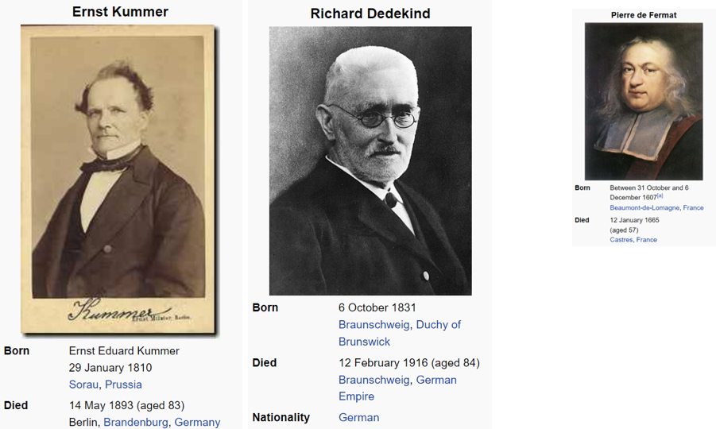
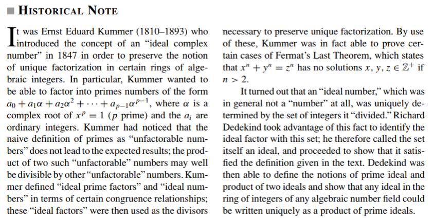

# Ring Homomorphism Properties

---

 Let $\varphi: R \to S$ be a ring homomorphism

## Basic Properties

- $\varphi(0_R) = 0_S$

- $\varphi(-a) = -\varphi(a)$ for all $a \in R$

- $A$ is a subring of $R \Rightarrow \varphi(A)$ is a subring of $S$

- $B$ is a subring of $S \Rightarrow \varphi^{-1}(B)$ is a subring of $R$

 The image of a subring is a subring, and the preimage of a subring is a subring.

---

# Unity of a Ring
A ring $R$ is said to have a **unity** or **multiplicative identity** if there exists an element $1_R \in R$ such that for all $a \in R$, $1_R a = a 1_R = a$.

---
# Embedding a Ring into a Ring with Unity

## Theorem

Every ring $R$ can be embedded in a ring with unity.

## Construction

Given a ring $(R, +, \cdot)$ without unity, consider:

$$S = \mathbb{Z} \times R$$

with operations defined by:

$$(n_1, r_1) + (n_2, r_2) = (n_1 + n_2, r_1 + r_2)$$

$$(n_1, r_1) \cdot (n_2, r_2) = (n_1 n_2, n_1 r_2 + n_2 r_1 + r_1 r_2)$$

---

# From now on: only consider the case when $R$ has unity $1_R$.

---

# Unity and Ring Homomorphisms

**Corollary:** If $\varphi$ is **surjective**, then $\varphi(1_R)$ is the unity of $S$.

---

**Warning:** If $\varphi$ is not a surjection, $\varphi(1_R)$ is not the unity of $S$ in general.

**Example:** $\varphi: \mathbb{Z} \to \mathbb{Z} \times \mathbb{Z}$

$a \mapsto (a, 0)$

$\mathbb{Z}$ has unity $1$, but $\varphi(1) = (1, 0)$

$\mathbb{Z} \times \mathbb{Z}$ has unity $(1, 1)$

--- 
# Product Ring

Given two rings $R$ and $S$, their **product ring** $R \times S$ is defined as the set of ordered pairs $(r, s)$ where $r \in R$ and $s \in S$, with component-wise addition and multiplication:

- **Addition:** $(r_1, s_1) + (r_2, s_2) = (r_1 + r_2, s_1 + s_2)$
- **Multiplication:** $(r_1, s_1) \cdot (r_2, s_2) = (r_1 \cdot r_2, s_1 \cdot s_2)$

The additive identity is $(0_R, 0_S)$ and the multiplicative identity (if both $R$ and $S$ have unities) is $(1_R, 1_S)$.

$R \times S$ is also called the **direct sum** of $R$ and $S$, write as $R \oplus S$.

---

---

---

# Ideal of a ring $R$

## Definition

Let $R$ be a ring. A subset $I \subseteq R$ is called an **ideal** of $R$ if it satisfies the following properties:

1. **Closure under subtraction:**  
   For all $a, b \in I$, we have $a - b \in I$.

2. **Absorption by ring elements:**  
   For all $r \in R$ and $a \in I$, both $ra \in I$ and $ar \in I$.

--- 
# Ideals in $\mathbb{Z}$

The ideals of the ring of integers $\mathbb{Z}$ are in bijection with the natural numbers $\mathbb{N}$ (including 0). Specifically, every ideal $I$ of $\mathbb{Z}$ is of the form:

$$
I = n\mathbb{Z} = \{ nk \mid k \in \mathbb{Z} \}
$$

for some unique non-negative integer $n \in \mathbb{N}$. This establishes a one-to-one correspondence:

$$
\{ \text{ideals of } \mathbb{Z} \} \leftrightarrow \mathbb{N}, \quad n\mathbb{Z} \leftrightarrow n
$$

For example:
- The zero ideal is $0\mathbb{Z} = \{0\}$
- The entire ring is $1\mathbb{Z} = \mathbb{Z}$
- The ideal $2\mathbb{Z}$ consists of all even integers

---
# Principal Ideals

## Definition

Let $R$ be a ring and let $a \in R$. The **principal ideal generated by $a$**, denoted $(a)$, is the smallest ideal of $R$ containing $a$. It consists of all elements of the form:

$$
(a) = \{ ra \mid r \in R \}
$$

*Example*

In $\mathbb{Z}$, every ideal is a principal ideal.

---
Let $F$ be a field.

**Theorem:**
Let $F$ be a field. 

**Theorem:** Every ideal in $F[x]$ is a principal ideal.

**Proof:**

Let $I$ be an ideal of $F[x]$.

Claim: $I = (g(x))$ where $g(x)$ is a nonzero polynomial of minimal degree in $I$.

Use the division algorithm for polynomials.

---
Upshot: $F[x]$ is similar to $\mathbb{Z}$ in that every ideal is principal.

---