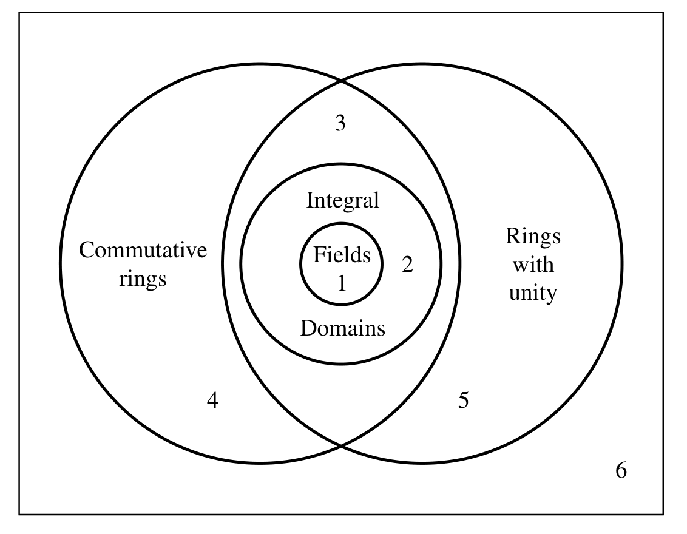

# Zero Divisors and Integral Domains

## Definition: Zero Divisor

Let $R$ be a ring with unity $1_R \neq 0_R$. An element $a \in R$ is called a **zero divisor** if there exists a nonzero element $b \in R$ such that either:

- $ab = 0_R$, or
- $ba = 0_R$

If $ab = 0_R$ for some nonzero $b \in R$, then $a$ is called a **left zero divisor**.
If $ba = 0_R$ for some nonzero $b \in R$, then $a$ is called a **right zero divisor**.

An element that is both a left and right zero divisor is simply called a **zero divisor**.

---

# Non-examples 

Units are not zero divisors.

---

## Example of Zero Divisors

In the ring $\mathbb{Z}_6 = \{0, 1, 2, 3, 4, 5\}$ under addition and multiplication modulo 6:

- Consider $2 \cdot 3 = 6 \equiv 0 \mod 6$
- So both $2$ and $3$ are zero divisors in $\mathbb{Z}_6$

---

# Zero Divisors in $\mathbb{Z}_n$

## Characterization

$$\{\text{zero divisors in } \mathbb{Z}_n\} = \{\bar{0}\neq \bar{k} \in \mathbb{Z}_n \mid \bar{k}\bar{x} = \bar{0} \text{ has a non-zero solution}\}$$

$\bar{k}$ is a zero divisor in $\mathbb{Z}_n$ if and only if $\gcd(k,n) > 1$.

---
## Zero Divisors in Matrix Algebra

Consider the ring of $2 \times 2$ matrices with real entries, denoted by $M_2(\mathbb{R})$. This ring has many zero divisors.

### Example

Take the following two nonzero matrices:

$$
A = \begin{pmatrix}
1 & 0 \\
0 & 0
\end{pmatrix}, \quad
B = \begin{pmatrix}
0 & 0 \\
1 & 0
\end{pmatrix}
$$

Compute their product:

$$
AB = \begin{pmatrix}
1 & 0 \\
0 & 0
\end{pmatrix}
\begin{pmatrix}
0 & 0 \\
1 & 0
\end{pmatrix}
= \begin{pmatrix}
0 & 0 \\
0 & 0
\end{pmatrix}
= 0_{2 \times 2}
$$

Thus, $A$ and $B$ are zero divisors in $M_2(\mathbb{R})$ because their product is the zero matrix, even though neither matrix is the zero matrix itself.

This shows that matrix rings generally contain zero divisors and hence are not integral domains.

---

# Zero divisor of $M_n(\mathbb{R})$

$\{\text{left zero\ divisor\ in\ }M_n(\mathbb{R})\} = \{0\neq A \in M_n(\mathbb{R}) \mid \exists\ B\neq 0\ \text{s.t.}\ AB=0\}$
  $= \{A \in M_n(\mathbb{R}) \mid A\ \text{is singular and non-zero}\}$

 Solution 

  $\{x \in M_{n\times 1}(\mathbb{R}) \mid Ax=0\}$
  - $\det A = 0$
  -  $\Rightarrow \text{rank}A < n$
- $\Rightarrow \text{dim ker}A = n - \text{rank} A \Rightarrow \text{ker} A$ is nontrivial. 
- Set $B = (b_1, b_2, ..., b_n)$ with $b_i$ non-zero and in $\text{ker}A$

---
# Corollary 

$\{right\ zero\ divisor\ in\ M_n(\mathbb{R})\} = \{left\ zero\ divisor\ in\ M_n(\mathbb{R})\}$

**Warning:** This is a corollary, not true for infinite dimensional matrix.

---

# Infinite dimensional matrix

Suppose $V$ is a vector space over a field $F$.

$End(V) := \{ f: V\to V \mid f\ \text{is a linear transformation} \}$ is the ring of linear transformations on $V$.

When $V$ is infinite dimensional, $End(V)$ can be understood as ``infinite dimensional matrix''. 

---

# Example: 

Let $V = \mathbb{C}[x]$  be the polynomial ring over $\mathbb{C}$. It is also a $\mathbb{C}$-vector space.

There are two natural linear transformations:

- $D: \mathbb{C}[x] \to \mathbb{C}[x]$ defined by $D(f(x)) = f'(x)$ (derivative)
- $M: \mathbb{C}[x] \to \mathbb{C}[x]$ defined by $I(f(x)) = xf(x)$ (multiplication by $x$)

$D$ is a left zero divisor but not a right zero divisor.

$M$ is a right zero divisor but not a left zero divisor.

---

# Zero divisor is not unit

Lemma: Zero divisors cannot be units in a ring.

Proof

Let $0\neq a \in R$ be a zero divisor with $ab = 0_R$ for some $b \neq 0_R$.

Suppose $a$ is a unit with inverse $a^{-1}$. Then:

$$b = 1_R \cdot b = (a^{-1}a)b = a^{-1}(ab) = a^{-1} \cdot 0_R = 0_R$$

This contradicts $b \neq 0_R$. Therefore, zero divisors cannot be units. $\square$

---

# $R$ is a disjoint union of 

- The set of zero divisors: $\{a \in R \mid \exists b \in R, b \neq 0, ab = 0\}$
- Units: Elements that have multiplicative inverses.
- The zero element: $0$, which is the additive identity.
- the set of other elements. 

---

## Definition: Integral Domain

A ring $R$ with unity $1_R \neq 0_R$ is called an **integral domain** if it satisfies the following conditions:

1. $R$ is commutative (i.e., $ab = ba$ for all $a, b \in R$)
2. $R$ has no zero divisors (i.e., for any $a, b \in R$, if $ab = 0_R$, then either $a = 0_R$ or $b = 0_R$)

Equivalently, an integral domain is a nonzero commutative ring in which the product of any two nonzero elements is always nonzero.

---

## Examples

- The ring of integers $\mathbb{Z}$ is an integral domain.
- Any field (such as $\mathbb{Q}, \mathbb{R}, \mathbb{C}$) is an integral domain.
- The ring $\mathbb{Z}_p$ where $p$ is prime is an integral domain (and actually a field).

---
## Non-example

- The ring $\mathbb{Z}_n$ where $n$ is composite is not an integral domain because it contains zero divisors.   

- The ring $\mathbb{Z} \times \mathbb{Z}$ is not an integral domain since $(1,0) \cdot (0,1) = (0,0)$, so it has zero divisors.

---

# More theorems

## Theorem
 Every field $F$ is an integral domain. 

## Theorem
 If $D$ is a domain, then $D[x]$ is an integral domain.

---

**Theorem**: Every finite integral domain is a field.

Proof

It suffices to show
* $\forall d \neq 0$, $d$ is invertible.

* $\Leftrightarrow$ the equation $dx = 1$ has a solution.

* $\Leftrightarrow$ the map $x \mapsto dx$ is a bijection.

* $\Leftrightarrow$ the map $x \mapsto dx$ is an injection by $|D|$ is finite.

---
## Variant

**Theorem**: Let $F$ be a field. Every finite dimensional $F$-algebra $A$ without zero divisors is a division ring.

---

----

# Characteristic of a ring 

## Definition: Characteristic of a Ring

Let $R$ be a ring with unity $1_R$. The **characteristic** of $R$, denoted $\text{char}(R)$, is:

$$\text{char}(R) = \begin{cases} 
n & \text{if } n \text{ is the smallest positive integer with } n \cdot r = 0_R \text{ for all } r \in R \\
0 & \text{if no such } n \text{ exists}
\end{cases}$$

---

## Examples

- $\text{char}(\mathbb{Z}) = \text{char}(\mathbb{Q}) = \text{char}(\mathbb{R}) = \text{char}(\mathbb{C}) = 0$
- $\text{char}(\mathbb{Z}_n) = n$

--- 

# Lemma

The characteristic of a ring $R$ is
- $n$ if $n$ is the smallest positive integer such that $n \cdot 1_R = 0_R$
- $0$ if for all $n \in \mathbb{Z}^+$, $n \cdot 1_R \neq 0_R$

---

## Theorem

If $R$ is an integral domain, then $\text{char}(R)$ is either $0$ or a prime number.

## Corollary

Let $F$ is a field.
- $\text{char}(F) = 0$, then $\mathbb{Q} \subseteq F$ 
- $\text{char}(F) = p$ (where $p$ is prime), then $\mathbb{Z}_p \subseteq F$ 

---

