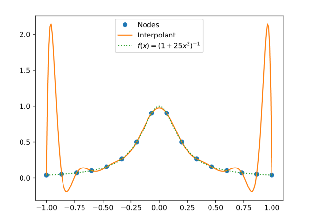
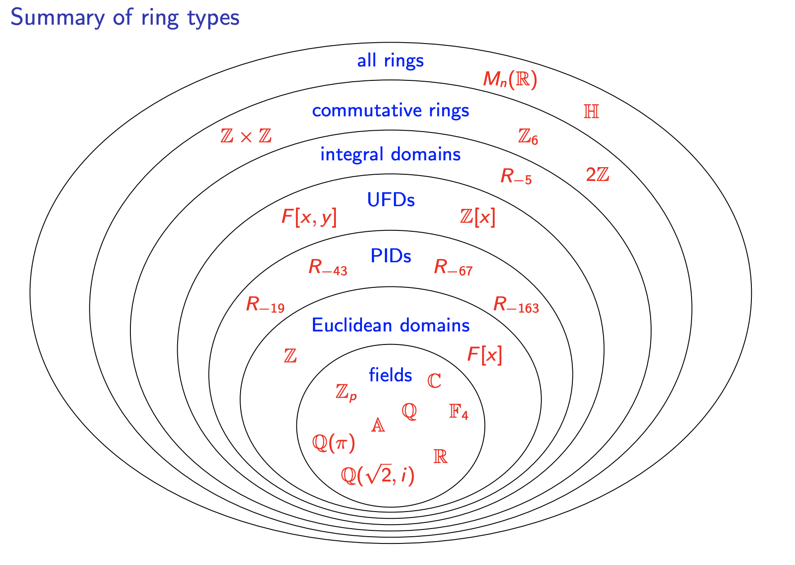

# Application of Ring theory

---
# More on polynomials

- $F$ is a field

- For $a \in F$, the evaluation map 
$$
   eval_a : F[x] \rightarrow F
$$ 

  is a ring homomorphism that evaluates polynomials at the point $a$.

  It is defined by $eval_a(f(x)) = f(a)$.

---

## Theorem: 
$\ker(eval_a) = ( x - a )$, the principal ideal generated by $(x - a)$.

## Corollary  
$(x-a)$ is a maximal ideal of $F[x]$.  

---
## Lagrange interpolation 

Given distinct points $a_1, a_2, \ldots, a_n \in F$ and values $b_1, b_2, \ldots, b_n \in F$, there exists a unique polynomial $f(x) \in F[x]$ of degree at most $n-1$ such that $f(a_i) = b_i$ for all $i$.

**Explicit formula:**
$$f(x) = \sum_{i=1}^n b_i \cdot L_i(x)$$
where $L_i(x) = \prod_{j \neq i} \frac{x-a_j}{a_i-a_j}$ are the Lagrange basis polynomials.

---
## Recall Chinese Remainder Theorem

For a ring $R$ and ideals $I_1, I_2, \ldots, I_n$, if the ideals are pairwise coprime (i.e., $I_i + I_j = R$ for $i \neq j$), then:

$$R / (I_1 \cap I_2 \cap \cdots \cap I_n) \cong R/I_1 \times R/I_2 \times \cdots \times R/I_n$$

---

Equivalently, for any $a_1, a_2, \ldots, a_n \in R$, there exists $x \in R$ such that:
$$x \equiv a_i \pmod{I_i} \text{ for all } i = 1, 2, \ldots, n$$

---
## Connection to Chinese Remainder Theorem:

Consider the evaluation homomorphism:
$$\phi: F[x] \rightarrow F \times F \times \cdots \times F$$
$$\phi(f(x)) = (f(a_1), f(a_2), \ldots, f(a_n))$$

The ideals $(x-a_1), (x-a_2), \ldots, (x-a_n)$ are pairwise coprime (since $\gcd(x-a_i, x-a_j) = 1$ for $i \neq j$).

By CRT, we have an isomorphism:
$$F[x] / \prod_{i=1}^n (x-a_i) \cong \prod_{i=1}^n F[x]/(x-a_i) \cong F^n$$

Since $\prod_{i=1}^n (x-a_i)$ has degree $n$, the space of polynomials of degree $< n$ maps bijectively to $F^n$.

---
## Runge's phenomenon 

Runge's phenomenon demonstrates the dangers of high-degree polynomial interpolation.

**Problem:** Given $n+1$ equally spaced points on $[-1, 1]$, interpolating certain functions (like $f(x) = \frac{1}{1+25x^2}$, Runge's function) with polynomials of degree $n$ leads to oscillations near the endpoints that grow unbounded as $n \to \infty$.

---

---
**Key observation:** 
- Even though the interpolating polynomial passes through all data points exactly
- The polynomial diverges dramatically between points, especially near boundaries
- This occurs despite Lagrange interpolation being mathematically correct

**Consequence:** High-degree polynomial interpolation is often unstable.

---
# Linear algebra and $F[x]$-module

Let $A$ be an $n \times n$ matrix over a field $F$.

We can define a ring homomorphism 
$$\phi: F[x] \rightarrow \text{Mat}_n(F)$$
 by mapping a polynomial $f(x)$ to $f(A)$.

**Definition:** For $f(x) = a_k x^k + a_{k-1} x^{k-1} + \cdots + a_1 x + a_0 \in F[x]$, define:
$$\phi(f(x)) = f(A) = a_k A^k + a_{k-1} A^{k-1} + \cdots + a_1 A + a_0 I$$
where $I$ is the $n \times n$ identity matrix.

---
# Definition of $R$-module 

An **$R$-module** is a generalization of vector spaces where scalars come from a ring $R$ instead of a field.

**Definition:** Let $R$ be a ring. A left $R$-module $M$ is an abelian group $(M, +)$ together with a scalar multiplication:
$$R \times M \rightarrow M, \quad (r, m) \mapsto r \cdot m$$

satisfying for all $r, s \in R$ and $m, n \in M$:
1. $r \cdot (m + n) = r \cdot m + r \cdot n$ (distributivity over addition in $M$)
2. $(r + s) \cdot m = r \cdot m + s \cdot m$ (distributivity over addition in $R$)
3. $(rs) \cdot m = r \cdot (s \cdot m)$ (associativity)
4. $1_R \cdot m = m$ (identity)

---
# Example

* an $F$-vector space is an $F$-module
* $F^n$ is a $Mat_n(F)$-module. 
* $F^n$ is a $F[x]$-module with $f \cdot v := f(A) v$.

---

## Minimal polynomial

Given a matrix $A \in \text{Mat}_n(F)$, the **minimal polynomial** $m_A(x)$ is the monic polynomial of smallest degree such that $m_A(A) = 0$.

## Kernel of $\phi$

The kernel of the evaluation homomorphism $\phi: F[x] \rightarrow \text{Mat}_n(F)$ is:
$$\ker(\phi) = \{f(x) \in F[x] : f(A) = 0\} = (m_A(x))$$

---

# Jordan canonical form over $\mathbb{C}$

Over $\mathbb{C}$, every matrix can be put into Jordan canonical form. The minimal polynomial is closely related to this form.

**Theorem:** For a matrix $A \in \text{Mat}_n(\mathbb{C})$ with eigenvalues $\lambda_1, \lambda_2, \ldots, \lambda_k$, the minimal polynomial is:
$$m_A(x) = \prod_{i=1}^k (x - \lambda_i)^{d_i}$$

where $d_i$ is the size of the largest Jordan block corresponding to eigenvalue $\lambda_i$.

---

# Primary decomposition theorem

## Theorem (Primary Decomposition for F[x]-modules)

Let $V$ be a finite-dimensional vector space over a field $F$, and let $T: V \rightarrow V$ be a linear operator. Then $V$ can be decomposed as a direct sum of $F[x]$-submodules:

$$V = V_1 \oplus V_2 \oplus \cdots \oplus V_k$$

where each $V_i$ is invariant under $T$, and the minimal polynomial of $T$ restricted to $V_i$ is a power of an irreducible polynomial $p_i(x)$.

---

## Connection to minimal polynomial

If the minimal polynomial of $T$ factors as:
$$m_T(x) = p_1(x)^{e_1} p_2(x)^{e_2} \cdots p_k(x)^{e_k}$$

where $p_i(x)$ are distinct irreducible polynomials, then:
$$V = \ker(p_1(T)^{e_1}) \oplus \ker(p_2(T)^{e_2}) \oplus \cdots \oplus \ker(p_k(T)^{e_k})$$

This decomposition is unique.

---

# Over $\mathbb{C}$ 

$p_i(x) = (x - \lambda_i)$ and 
the spaces $V_i$ are called generalized eigenspace.  

---
## Question: How to find other maximal ideals of $F[x]$. 

* Theorem: Let $F$ be a field. An ideal $(p(x))$ of $F[x]$ is maximal if and only if $p(x)$ is irreducible over $F$.

---

# How to determine a polynomial is irreducible or not?

## Determining Irreducibility

For polynomials over specific fields:

- **Over $\mathbb{C}$**: Only linear polynomials are irreducible (Fundamental Theorem of Algebra)

- **Over $\mathbb{R}$**: Irreducible polynomials are linear or quadratic with no real roots

- **Over finite fields $\mathbb{F}_p$**: Can check all elements for roots (feasible for small fields)

- **Over $\mathbb{Q}$**: Much more challenging!

---

## Eisenstein's Criterion

**Theorem (Eisenstein):** Let $f(x) = a_n x^n + a_{n-1} x^{n-1} + \cdots + a_1 x + a_0 \in \mathbb{Z}[x]$.

If there exists a prime $p$ such that:
1. $p \nmid a_n$ (p does not divide the leading coefficient)
2. $p \mid a_i$ for all $i < n$ (p divides all other coefficients)
3. $p^2 \nmid a_0$ (p² does not divide the constant term)

Then $f(x)$ is irreducible over $\mathbb{Q}$.

---

## Example: Eisenstein's Criterion

**Example 1:** $f(x) = x^4 + 2x^3 + 4x + 2$

Choose $p = 2$:
- $2 \nmid 1$ (leading coefficient)
- $2 \mid 2, 4, 2$ (other coefficients)
- $2^2 = 4 \nmid 2$ (constant term)

Therefore, $f(x)$ is irreducible over $\mathbb{Q}$.

---

**Example 2:** $f(x) = x^p - 1 = (x-1)(x^{p-1} + x^{p-2} + \cdots + x + 1)$ for prime $p$.

The second factor $g(x) = x^{p-1} + x^{p-2} + \cdots + x + 1$ is irreducible.

**Proof:** Consider $g(x+1) = \frac{(x+1)^p - 1}{x} = \binom{p}{1}x^{p-2} + \binom{p}{2}x^{p-3} + \cdots + \binom{p}{p-1}$.

Since $p \mid \binom{p}{k}$ for $1 \leq k < p$ and $p^2 \nmid \binom{p}{p-1} = p$, Eisenstein applies with prime $p$.

Since $g(x)$ irreducible implies $g(x+1)$ irreducible, $g(x)$ is irreducible over $\mathbb{Q}$.

---

## Reduction mod p

**Definition:** For a prime $p$, the reduction mod $p$ homomorphism is defined as:
$$
\pi_p: \mathbb{Z}[x] \longrightarrow \mathbb{F}_p[x] = \mathbb{Z}_p[x]
$$

This map is given by reducing each coefficient modulo $p$:
$$
\pi_p(a_n x^n + a_{n-1} x^{n-1} + \cdots + a_1 x + a_0) = \overline{a_n} x^n + \overline{a_{n-1}} x^{n-1} + \cdots + \overline{a_1} x + \overline{a_0}
$$

where $\overline{a_i} \in \mathbb{F}_p$ denotes the residue class of $a_i$ modulo $p$.

---
**Key properties:**
- $\pi_p$ is a ring homomorphism
- Preserves degree when leading coefficient is not divisible by $p$
- If $f(x) \in \mathbb{Z}[x]$ factors over $\mathbb{Z}$, then $\pi_p(f(x))$ factors over $\mathbb{F}_p$
- Useful for testing irreducibility: if $\pi_p(f(x))$ is irreducible over $\mathbb{F}_p$ and $\deg(\pi_p(f)) = \deg(f)$, then $f(x)$ is irreducible over $\mathbb{Q}$

---
## Proof of Eisenstein's Criterion by reduction mod p

**Proof sketch:**

Suppose $f(x) = a_n x^n + \cdots + a_0$ satisfies Eisenstein's criterion for prime $p$.

Assume for contradiction that $f(x) = g(x)h(x)$ where $g, h \in \mathbb{Z}[x]$ are non-constant.

Let 
$$g(x) = b_k x^k + \cdots + b_0$$ 
and 
$$h(x) = c_\ell x^\ell + \cdots + c_0$$ 
with $k, \ell \geq 1$.

---

**Reduce modulo $p$:**
- Since $p \mid a_i$ for $i < n$ but $p \nmid a_n$, we have $\overline{f}(x) = \overline{a_n} x^n$ in $\mathbb{Z}_p[x]$
- Thus $\overline{g}(x) \overline{h}(x) = \overline{a_n} x^n$ in $\mathbb{Z}_p[x]$
- Since $\mathbb{Z}_p[x]$ is a UFD, this means $\overline{g}(x) = \alpha x^k$ and $\overline{h}(x) = \beta x^\ell$ for some $\alpha, \beta \in \mathbb{F}_p$
- Therefore $p \mid b_0$ and $p \mid c_0$

---

**Examine the constant term:**
- Since $f(x) = g(x)h(x)$, we have $a_0 = b_0 c_0$
- But $p \mid b_0$ and $p \mid c_0$ implies $p^2 \mid a_0$
- This contradicts condition (3) of Eisenstein's criterion

Therefore, $f(x)$ cannot be factored non-trivially, so $f(x)$ is irreducible over $\mathbb{Q}$.

---

# Unique factorization domain

A **unique factorization domain** (UFD) is an integral domain in which every non-zero, non-unit element can be written as a product of irreducible elements, and this factorization is unique up to order and units.

**Definition:** An integral domain $R$ is a UFD if:
1. Every non-zero, non-unit element $a \in R$ can be written as a product of irreducible elements:
   $$a = p_1 p_2 \cdots p_n$$
   where each $p_i$ is irreducible.

---

2. This factorization is unique up to order and associates: if 
   $$a = p_1 p_2 \cdots p_n = q_1 q_2 \cdots q_m$$
   where $p_i$ and $q_j$ are all irreducible, then $n = m$ and after reordering, $p_i$ and $q_i$ are associates (i.e., $p_i = u_i q_i$ for some unit $u_i$).

---

## Facts

- In a UFD, irreducible elements are prime
- Every **principal ideal domain** (PID) is a UFD
- Examples: $\mathbb{Z}$, $F[x]$ where $F$ is a field, $\mathbb{Z}[x]$
- Non-example: $\mathbb{Z}[\sqrt{-5}]$ (e.g., $6 = 2 \times 3 = (1+\sqrt{-5})(1-\sqrt{-5})$)

---
# The ring of integers of a quadratic field 

For a square-free integer $m$, define $\mathbb{Q}(\sqrt{m})$ to be the quadratic field consisting of all numbers of the form $a + b\sqrt{m}$ where $a, b \in \mathbb{Q}$.

The **ring of integers** of $\mathbb{Q}(\sqrt{m})$, denoted $\mathcal{O}_m$ or $R_m$, is defined as:

$$R_m = \begin{cases}
\mathbb{Z}[\sqrt{m}] = \{a + b\sqrt{m} : a, b \in \mathbb{Z}\} & \text{if } m \equiv 2, 3 \pmod{4} \\
\mathbb{Z}\left[\frac{1+\sqrt{m}}{2}\right] = \left\{a + b\frac{1+\sqrt{m}}{2} : a, b \in \mathbb{Z}\right\} & \text{if } m \equiv 1 \pmod{4}
\end{cases}$$

**Examples:**
- $R_{-5} = \mathbb{Z}[\sqrt{-5}]$ (not a UFD: $6 = 2 \times 3 = (1+\sqrt{-5})(1-\sqrt{-5})$)
- $R_{-1} = \mathbb{Z}[i]$ (the Gaussian integers, which is a UFD)
- $R_5 = \mathbb{Z}\left[\frac{1+\sqrt{5}}{2}\right]$ (related to the golden ratio)

---
